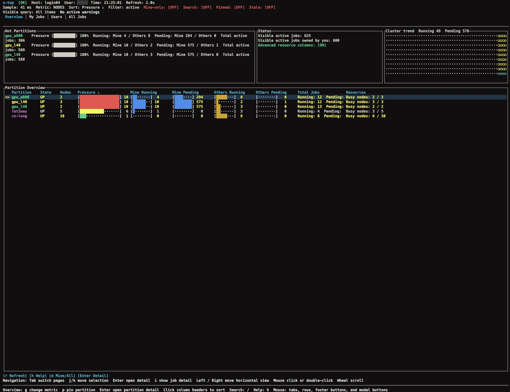
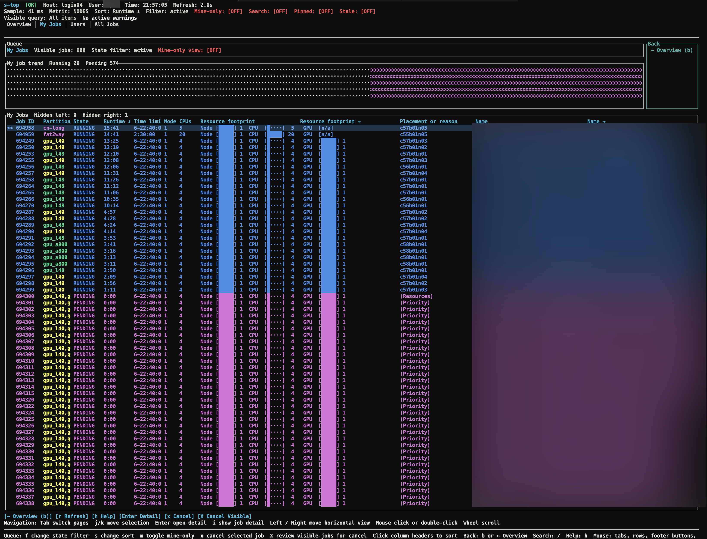
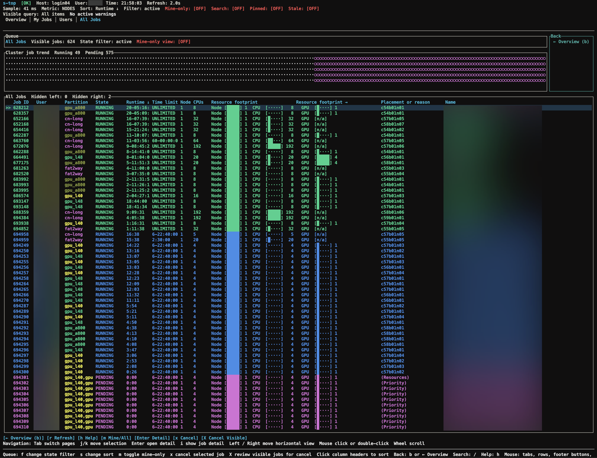
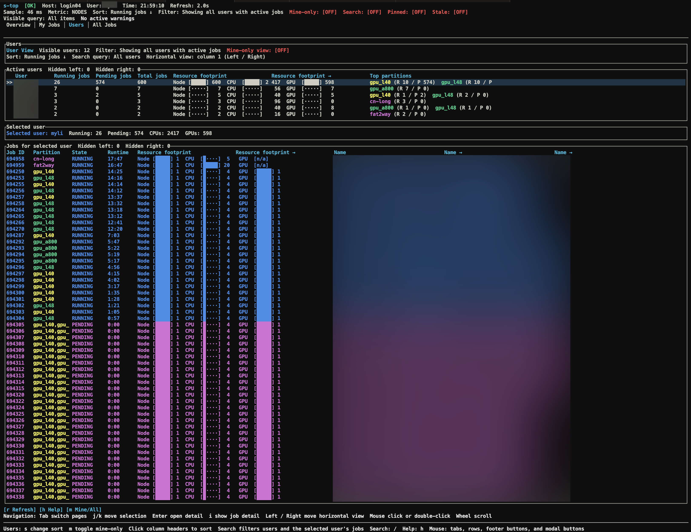
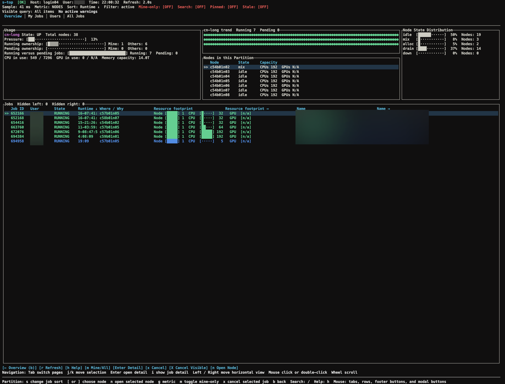
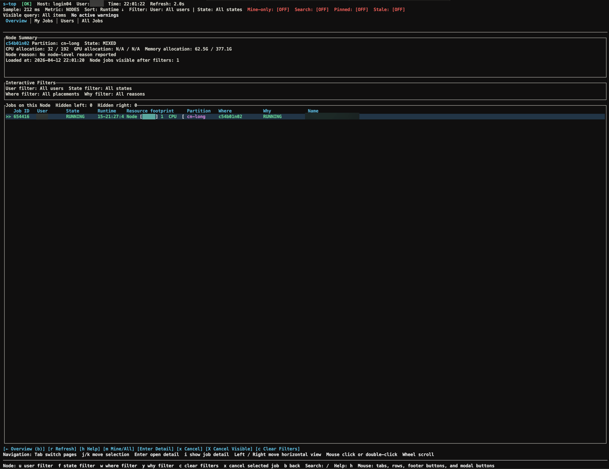
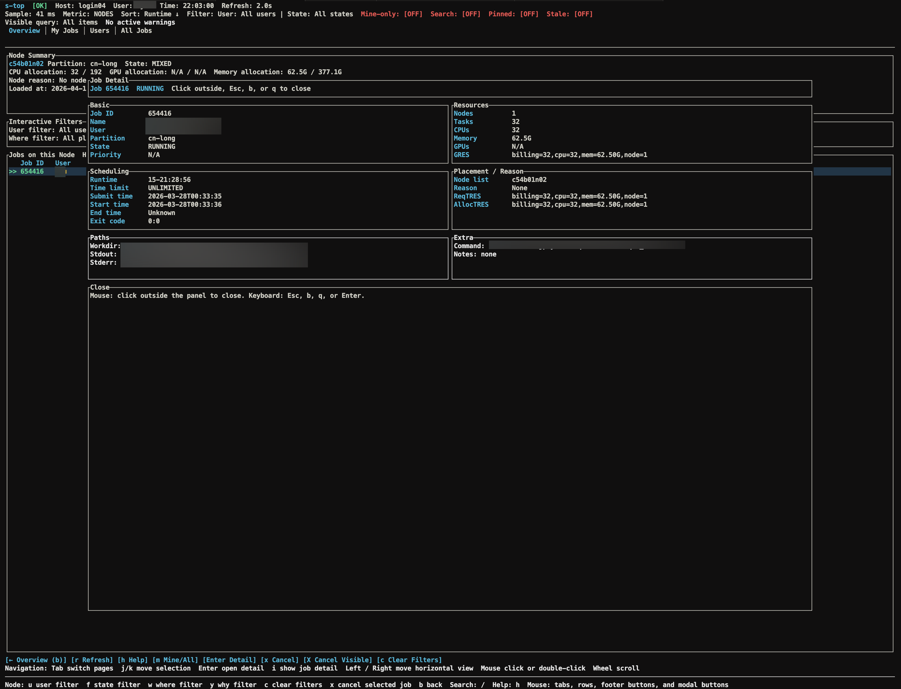
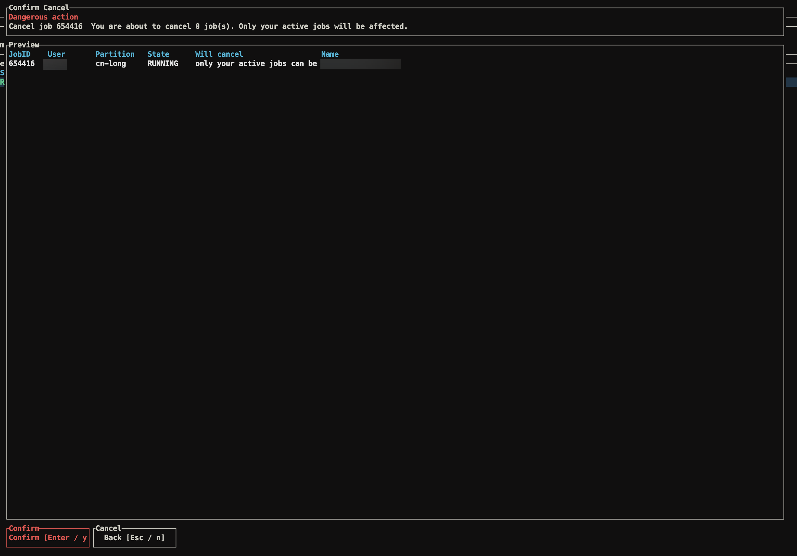

# sqtop

[English](./README.md) | [中文](./README.zh-CN.md)


`sqtop` is an interactive terminal monitor for Slurm clusters. It gives ordinary HPC users a readable, continuously refreshed view of partitions, queues, users, nodes, and jobs without requiring `slurmrestd`, root access, or Slurm JSON output.

The project was previously published as `s-top`. The current executable, crate, and conda package name is `sqtop`.

## Why sqtop

`squeue`, `sinfo`, and `watch` are reliable, but they are not ideal for answering scheduler questions quickly:

- Which partitions are saturated right now?
- How much of the queue belongs to me versus other users?
- Which users are consuming the most jobs and resources?
- Which jobs are running, pending, or stuck for a specific reason?
- What changed over the last few refresh cycles?

`sqtop` focuses on those questions and stays compatible with typical user-level Slurm environments.

## Highlights

- Live partition overview with queue pressure, ownership split, and trend history
- Separate `My Jobs`, `All Jobs`, `Users`, `Partition Detail`, and `Node Detail` views
- Structured job detail and conservative `scancel` preview / result flows
- Text-based Slurm collection path designed for clusters where `--json` is unavailable
- Search, filtering, sorting, paging, and horizontal navigation for wide tables
- Mouse support for tabs, rows, modal actions, and sortable headers

## Screenshots

| View | Preview |
| --- | --- |
| Overview |  |
| My Jobs |  |
| All Jobs |  |
| Users |  |
| Partition Detail |  |
| Node Detail |  |
| Job Detail |  |
| Cancel Preview |  |

## Install

### From crates.io

```bash
cargo install sqtop
```

### From conda

```bash
conda install -c wubeizhongxinghua sqtop
```

If you want `conda install sqtop` to work without `-c`, add the channel once:

```bash
conda config --add channels wubeizhongxinghua
conda install sqtop
```

### From source

```bash
cargo build --release
./target/release/sqtop
```

## Quick start

Run the TUI:

```bash
sqtop
```

Collect one snapshot and print a summary:

```bash
sqtop --once
```

Use a faster refresh interval:

```bash
sqtop --interval 2
```

Dump raw and parsed collector output for troubleshooting:

```bash
sqtop --debug-dump
```

## Typical use cases

- Check whether a partition is congested before submitting a job
- Compare your current queue footprint with other users on the cluster
- Inspect jobs on a specific partition or node
- Find pending jobs by reason, placement, or owner
- Review a selected job before canceling it

## Views

### Overview

The default page shows partition pressure, mine-versus-others usage, running-versus-pending counts, and rolling trends.

### My Jobs

Focused view of the current user's active jobs, including resource footprint, placement, search, and cancel actions.

### All Jobs

Cluster-wide active queue view with highlighting for the current user's jobs.

### Users

Ranks active users by running jobs, pending jobs, total jobs, and resource footprint. The lower pane shows the selected user's active jobs.

### Partition Detail

Adds partition-local trends, node-state distribution, node list, and jobs in the selected partition.

### Node Detail

Shows jobs on a node with interactive `user`, `state`, `where`, and `why` filters.

### Job Detail

Opens a structured detail modal for a selected job, grouped into identity, resources, scheduling, placement, and execution sections.

### Cancel Preview and Result

Reviews eligible and blocked `scancel` targets before execution, then reports detailed per-job results afterward.

## Keyboard and mouse

### Keyboard

| Key | Action | Scope |
| --- | --- | --- |
| `Tab` / `Shift-Tab` | Switch top-level pages | Global |
| `q` | Go back from detail pages; quit from top-level pages | Global |
| `j` / `k` / Up / Down | Move selection or scroll | Lists and modals |
| `Space` / `b` | Page down / page up | Lists and modals |
| `g` / `G` | Jump to top / bottom | Lists and modals |
| `Enter` | Open the focused detail | Overview and lists |
| `/` | Start live search | Searchable views |
| `s` | Cycle sort key | Overview, Users, job lists |
| `f` | Cycle queue-state filter | Job lists |
| `m` | Toggle mine-only mode | Shared views |
| `p` | Pin or unpin the current partition | Overview and job views |
| `[` / `]` | Change selected node | Partition Detail |
| `n` | Open selected node | Partition Detail |
| `u` / `w` / `y` / `c` | Change or clear node filters | Node Detail |
| `i` | Open job detail | Job lists |
| `x` | Cancel the selected job | Job lists |
| `X` | Preview bulk cancel | Job lists |
| `Left` / `Right` | Move horizontal table viewport | Wide tables |

### Mouse

| Interaction | Result |
| --- | --- |
| Click a tab | Switch page |
| Click a row | Select row |
| Double-click a row | Open detail |
| Click a sortable header | Sort by that column |
| Mouse wheel | Scroll the active list or modal |
| Click a modal action | Trigger that action |
| Click outside the job-detail modal | Close the modal |

## CLI options

| Flag | Description |
| --- | --- |
| `--interval <seconds>` | Refresh interval. Default: `2.0` |
| `--user <name>` | Override the identity used for Mine / Others |
| `--all` | Start on the All Jobs page |
| `--no-all-jobs` | Disable the All Jobs page |
| `--theme <auto\|dark\|light>` | Select the UI theme |
| `--advanced-resources` | Force advanced resource columns on |
| `--no-advanced-resources` | Hide advanced resource columns |
| `--debug-dump` | Print raw and parsed data, then exit |
| `--once` | Collect once, print a summary, then exit |
| `--compact` | Use a denser layout |
| `--no-color` | Disable color output |

## Data sources and compatibility

The live path is intentionally built around text-oriented Slurm commands:

- `sinfo`
- `squeue`
- `scontrol show partition`
- `scontrol show node`
- `scontrol show job`

`sacct` is used only for detail enrichment or optional historical views and is not required for the main TUI.

The collector is designed for user-level environments:

- no root privileges assumed
- no `slurmrestd`
- no requirement for `squeue --json` or `sinfo --json`
- graceful degradation when optional fields are unavailable

## Project status

The repository is actively packaged and released through GitHub tags. For upcoming improvements, use the issue tracker and release history as the authoritative source instead of expecting a separate long-term roadmap document here.

## Project layout

| Path | Responsibility |
| --- | --- |
| `src/collector/` | Slurm command execution, timeout handling, cancellation, raw collection |
| `src/model/` | Parsers, normalized data structures, aggregation |
| `src/app.rs` | Application state, refresh orchestration, filtering, sorting, event handling |
| `src/ui/` | Rendering, themes, view composition, mouse hit testing |
| `src/cli.rs` | CLI parsing and current-user resolution |
| `src/config.rs` | Optional configuration support |
| `recipe/` | Conda recipe and build scripts |
| `.github/workflows/` | Release packaging and registry publishing |

## Limitations

- Availability of `ReqTRES`, `AllocTRES`, `GRES`, memory, and GPU fields depends on site configuration
- Pending jobs that are eligible for multiple partitions may appear in more than one partition-level pending aggregation
- Narrow terminals still require horizontal navigation on wide tables
- Trend rendering depends on terminal font support for Unicode symbols
- Conda packaging currently targets Linux `x86_64`
- The Linux conda package currently targets a `glibc` baseline of `2.17`

## Community and support

- [Contributing](CONTRIBUTING.md)
- [Code of Conduct](CODE_OF_CONDUCT.md)
- [Support](SUPPORT.md)
- [Security policy](SECURITY.md)
- [Citation](CITATION.cff)
- [Changelog](CHANGELOG.md)

## License

This project is distributed under the MIT license. See [LICENSE](LICENSE).
